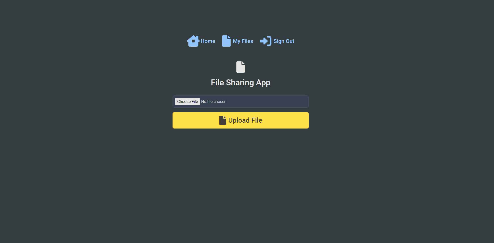

# FrontEnd File Sharing Application (Module #6, MERN Stack)


## Hosted Version of the Project:
[File Sharing Application](https://frontend-m6node-file-sharing-application.vercel.app/)

## BackEnd GitHub Repository Link
[BackEnd File Sharing Application](https://github.com/Alex21c/m6node-file-sharing-application)

## Overview:
In this project i have developed the a robust and scalable file sharing application.

## Objectives: 
+ Understand the architecture and design principles of a file sharing application.
+ Learn to set up and configure backend servers for file storage and management.
+ Develop secure and efficient APIs for file upload, download, and sharing.
+ Implement user authentication and authorization mechanisms.
+ Ensure data security and integrity through encryption and access controls.
+ Optimize storage solutions and handle large volumes of data.
+ Troubleshoot common issues and ensure high availability of the application.

## Key features:
+ MVC Framework was used to built the application
+ MongoDB as backend Database 
+ ExpressJS for Server Implementation
+ NodeJS for BackEnd
+ ReactJS for FrontEnd

## How to install and run in yours local machine
```bash
npm install
npm run start
```

## Tech. Stack Used:
+ [MongoDB](https://www.mongodb.com/) 
+ [ExpressJS](https://expressjs.com/) 
+ [ReactJS](https://react.dev/) 
+ [NodeJS](https://nodejs.org/en/) 

## Author
[Abhishek kumar](https://www.linkedin.com/in/alex21c/), ([Geekster](https://geekster.in/) MERN Stack FS-14 Batch)


